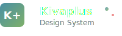

<div align="center">
  

  # Kivaplus Design System

  A comprehensive React design system with accessible components built with TypeScript and Tailwind CSS.

  [](https://badge.fury.io/js/kivaplus-design-system)
  [](https://opensource.org/licenses/MIT)
  [](https://www.typescriptlang.org/)
  [](https://www.w3.org/WAI/WCAG21/quickref/)
</div>

## Features

- 🎨 **25+ Components** - Complete set of UI components
- ♿ **WCAG 2.1 AA Compliant** - Full accessibility support
- 🎯 **TypeScript** - Full type safety
- 🎨 **Tailwind CSS** - Utility-first styling
- 📱 **Responsive** - Mobile-first design
- 🧪 **Storybook** - Interactive component documentation
- 🚀 **Tree-shakable** - Import only what you need

## Installation

```bash
npm install kivaplus-design-system
```

### Peer Dependencies

Make sure you have the required peer dependencies installed:

```bash
npm install react react-dom
```

## Setup

### 1. Import Styles

Import the CSS file in your main application file:

```tsx
import 'kivaplus-design-system/styles'
```

### 2. Configure Tailwind CSS (Optional)

If you're using Tailwind CSS in your project, you can extend the design system's configuration:

```js
// tailwind.config.js
module.exports = {
  content: [
    './src/**/*.{js,ts,jsx,tsx}',
    './node_modules/kivaplus-design-system/dist/**/*.{js,ts,jsx,tsx}'
  ],
  // ... your config
}
```

## Usage

```tsx
import { Button, Input, Card } from 'kivaplus-design-system'

function App() {
  return (
    <Card>
      <Input label="Email" type="email" />
      <Button variant="primary">Submit</Button>
    </Card>
  )
}
```

## Components

### Form Components
- `Input` - Text inputs with validation
- `Textarea` - Multi-line text input
- `Select` - Dropdown selection
- `Checkbox` - Single checkbox
- `CheckboxGroup` - Multiple checkbox group
- `Radio` - Radio button
- `RadioGroup` - Radio button group
- `Switch` - Toggle switch

### Layout Components
- `Card` - Content container
- `Modal` - Dialog overlay
- `Accordion` - Collapsible content
- `Tabs` - Tabbed interface

### Navigation Components
- `Button` - Action buttons
- `ActionButton` - Icon buttons
- `Breadcrumb` - Navigation breadcrumbs

### Data Display
- `Table` - Data tables with sorting/filtering
- `SimpleDataTable` - Easy-to-use data table
- `ServerDataTable` - Server-side data table
- `Badge` - Status indicators
- `Chip` - Compact information
- `Avatar` - User avatars
- `Progress` - Progress indicators
- `Skeleton` - Loading placeholders

### Feedback Components
- `Alert` - Alert messages
- `AlertDialog` - Confirmation dialogs
- `Toast` - Notification toasts
- `Tooltip` - Contextual help

### Headers
- `PageHeader` - Page-level headers
- `SectionHeader` - Section headers
- `StatsHeader` - Headers with statistics

## Accessibility

All components follow WCAG 2.1 AA guidelines and include:

- Proper ARIA attributes
- Keyboard navigation support
- Screen reader compatibility
- Focus management
- Color contrast compliance

See [ACCESSIBILITY.md](./ACCESSIBILITY.md) for detailed accessibility information.

## TypeScript Support

The package includes full TypeScript definitions. All component props are typed for the best development experience.

```tsx
import { InputProps } from 'kivaplus-design-system'

const MyInput: React.FC<InputProps> = (props) => {
  return <Input {...props} />
}
```

## Utilities

### `cn` Function

A utility function for merging Tailwind CSS classes:

```tsx
import { cn } from 'kivaplus-design-system'

const className = cn('base-class', condition && 'conditional-class')
```

## Browser Support

- Chrome (latest)
- Firefox (latest)
- Safari (latest)
- Edge (latest)

## About the Author

<div align="center">
  

  **Marcos Rangel**
  *Fullstack Developer & Design System Architect*

  [](https://github.com/mrangel-jr)
  [](https://linkedin.com/in/marcos-rangel-jr)
  [](mailto:mrangel@gmail.com)
</div>

### 👨‍💻 About Me

I'm a passionate frontend developer with expertise in creating scalable design systems and accessible user interfaces. The Kivaplus Design System represents my commitment to building inclusive, well-documented, and developer-friendly component libraries.

**Specialties:**
- 🎨 Design Systems & Component Architecture
- ♿ Web Accessibility (WCAG 2.1 AA)
- ⚛️ React & TypeScript Development
- 🎯 User Experience Design
- 📚 Technical Documentation

### 🚀 Why I Built This

This design system was born from the need for:
- **Consistency** across multiple projects
- **Accessibility-first** approach to UI development
- **Developer Experience** with comprehensive documentation
- **Scalability** for teams of any size

### 💬 Let's Connect

I'm always interested in discussing:
- Design system best practices
- Accessibility in web development
- React component architecture
- Open source collaboration

Feel free to reach out if you have questions, suggestions, or just want to chat about frontend development!

---

## Contributing

We welcome contributions! Please see our contributing guidelines for more information.

## License

MIT License - see LICENSE file for details.

## Support

- 📖 [Storybook Documentation](https://your-storybook-url.com)
- 🐛 [Report Issues](https://github.com/yourusername/kivaplus-design-system/issues)
- 💬 [Discussions](https://github.com/yourusername/kivaplus-design-system/discussions)
